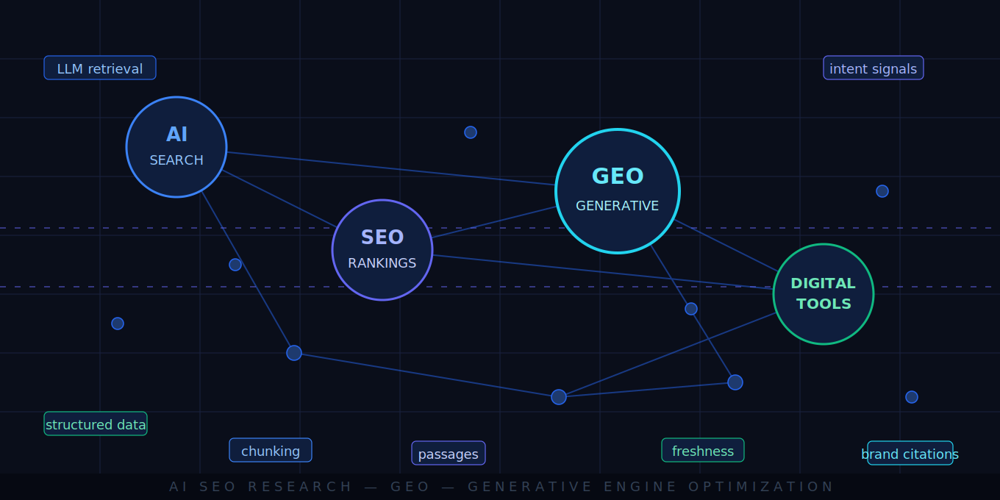

# GEO Matrix: A Systems-First SOP for AI-Powered SEO Content

*A structured research repository documenting how AI is reshaping SEO content production — from keyword-based ranking to generative engine optimization (GEO).*

**Erian Hadi**  
Built as part of a growth marketing application project, April 2026.

---

## Table of Contents

- [Who is this for?](#who-is-this-for)
- [Why this playbook?](#why-this-playbook)
- [The SEO shift at a glance](#the-seo-shift-at-a-glance)
- [Repository structure](#repository-structure)
- [The 10 experts](#the-10-experts)
  - [Selection criteria](#selection-criteria)
  - [Expert profiles](#expert-profiles)
- [Research methodology](#research-methodology)
  - [Source collection](#source-collection)
  - [Data collection process](#data-collection-process)
- [Playbook](#playbook)
- [Acknowledgments](#acknowledgments)

---

## Who is this for?

This document is for growth marketers, SEO practitioners, and content strategists who want to understand and apply **AI-powered SEO content production** in practice.

The research covers how AI tools and workflows are changing the way content is created, structured, and optimized for both traditional search engines and AI-driven discovery systems like ChatGPT, Perplexity, and Google AI Overviews.

Basic familiarity with SEO concepts (rankings, backlinks, on-page optimization) is assumed. No deep technical knowledge is required.

## Why this playbook?

***Summary:*** *Most AI SEO content is opinion. This repository collects and synthesizes what practitioners who actually build these systems are doing, then turns it into a usable SOP.*

The internet is full of hot takes on "AI SEO." What's rare is:

- Practitioners sharing real systems with documented results (not theory)
- Honest disagreements between experts, rather than consensus-washing
- A clear, actionable SOP that tells you what to do *in what order*

This repository was built to fill that gap. The 10 experts selected here were chosen because they ship working systems, not because they have large audiences. The playbook that follows is grounded entirely in their documented outputs.

---

## The SEO shift at a glance

In 2026, SEO runs as two parallel games. Winning the first makes you *eligible* for the second.

| | Traditional SEO | AI Search (GEO) |
|---|---|---|
| | Keywords | Intent + reasoning |
| | Rankings | Recommendations |
| | Pages | Passages |
| | Traffic | Conversions |

Traditional search (Google, Bing) still drives the majority of site traffic, but AI platforms (ChatGPT, Perplexity, Google AI Overviews) are growing fast and operate on fundamentally different rules. AI systems don't return a list of links — they synthesize an answer and cite sources. Getting cited is the new ranking.

The critical connection: AI platforms that use live web search (RAG) pull from whatever is currently ranking in traditional search. Winning traditional search is what makes you a *candidate* for AI citation in the first place.

---

## Repository structure

```
ai-seo-research/
│
├── research
│   ├── linkedin-posts
│   │   ├── .gitkeep
│   │   ├── eric-siu.md
│   │   ├── koray-tugberk-gubur.md
│   │   ├── mike-king.md
│   │   ├── neil-patel.md
│   │   ├── tom-niezgoda.md
│   │
│   ├── other
│   │   ├── .gitkeep
│   │   ├── banner.svg
│   │   ├── eric-siu.png
│   │   ├── tom-niezgoda.jpg
│   │
│   ├── youtube-transcripts
│   │   ├── .gitkeep
│   │   ├── gael-breton.md
│   │   ├── julian-goldie-link-building.md
│   │   ├── mark-webster.md
│   │   ├── matt-diggity-ai-seo.md
│   │   ├── nathan-gotch-new-playbook.md
│   │
│   └── sources.md
│
├── scripts
│   └── monitor_drift.py
│
├── LICENSE
├── PLAYBOOK.md
└── README.md
```

**Note on structure:** Sources are organized by platform (LinkedIn posts, YouTube transcripts) to preserve the original collection context and make it easy to verify raw sources. The playbook synthesizes across both per expert.

---

## The 10 experts

### Selection criteria

***Summary:*** *Experts were selected on one criterion: they build and ship real AI-SEO systems with documented results, not commentary.*

Each expert included here has a track record of sharing:

- Case studies with before/after data
- Specific workflows, tools, or systems they use in production
- At least one source from 2025 to 2026, reflecting the current AI search landscape

Experts who primarily share opinion pieces, general strategy, or repackaged advice from others were excluded regardless of audience size.

### Expert profiles

| # | Expert | Focus | Why Selected | Source File |
|---|--------|-------|-------------|-------------|
| 1 | [**Matt Diggity**](https://www.linkedin.com/in/mattdiggity/) | SEO testing, AI workflows | Data-driven experiments with real ranking case studies; documented a 2,000%+ AI traffic increase for a client | [matt-diggity-ai-seo.md](research/youtube-transcripts/matt-diggity-ai-seo.md) |
| 2 | [**Julian Goldie**](https://www.linkedin.com/in/juliangoldie/) | AI SEO automation, link building | Practical tutorials on scaling content production with AI; shares specific tools and processes | [julian-goldie-link-building.md](research/youtube-transcripts/julian-goldie-link-building.md) |
| 3 | [**Nathan Gotch**](https://www.linkedin.com/in/nathangotch/) | SEO fundamentals, AI-assisted content | Bridges strong SEO foundations with modern AI workflows; author of *AI SEO for Dummies*; runs two SEO companies | [nathan-gotch-new-playbook.md](research/youtube-transcripts/nathan-gotch-new-playbook.md) |
| 4 | [**Gael Breton**](https://www.linkedin.com/in/gaelbreton/) | Authority sites, AI content systems | Builds structured, scalable AI-driven content systems; provides skeptical counterweight to GEO hype | [gael-breton.md](research/youtube-transcripts/gael-breton.md) |
| 5 | [**Mark Webster**](https://www.linkedin.com/in/mark-webster-authority-hacker/) | SEO systems, content scaling | Focuses on repeatable systems for scaling SEO content; co-founder of Authority Hacker | [mark-webster.md](research/youtube-transcripts/mark-webster.md) |
| 6 | [**Mike King**](https://www.linkedin.com/in/michaelkingphilly/) | Technical SEO, semantic search, AI search | Connects SEO with embeddings, information retrieval, and how AI interprets content at the passage level | [mike-king.md](research/linkedin-posts/mike-king.md) |
| 7 | [**Koray Tuğberk GÜBÜR**](https://www.linkedin.com/in/koray-tugberk-gubur/) | Semantic SEO, topical authority | Advanced content structure and search intent optimization; documented case studies on entity-based SEO | [koray-tugberk-gubur.md](research/linkedin-posts/koray-tugberk-gubur.md) |
| 8 | [**Tomasz Niezgoda**](https://www.linkedin.com/in/niezgoda-tomasz/) | AI content optimization, on-page SEO | Works directly on AI-powered SEO tools at Surfer SEO; shares original research data on AI citation patterns | [tom-niezgoda.md](research/linkedin-posts/tom-niezgoda.md) |
| 9 | [**Eric Siu**](https://www.linkedin.com/in/ericosiu/) | B2B marketing, AI-driven growth | Runs 7 AI agents in production; shares operational insights on AI system maintenance that most practitioners ignore | [eric-siu.md](research/linkedin-posts/eric-siu.md) |
| 10 | [**Neil Patel**](https://www.linkedin.com/in/neilkpatel/) | SEO, content marketing, AI tools | High-volume practitioner; included for breadth and for critical analysis of methodology quality | [neil-patel.md](research/linkedin-posts/neil-patel.md) |

---

## Research methodology

### Source collection

***Summary:*** *Each expert was tracked across their primary content channels. Sources were selected for recency (2025 to 2026) and specificity (concrete claims over general advice).*

For each expert, the following source types were collected where available:

- **YouTube videos** — prioritizing tutorial-style content with specific tactics or case studies over interviews or commentary
- **LinkedIn posts** — prioritizing posts with original data, frameworks, or documented experiments
- **Blog posts and tools** — where linked directly from the above

Full source list with URLs, publication dates, and annotations: [`research/sources.md`](research/sources.md)

### Data collection process

YouTube transcripts were collected via the [Supadata API](https://supadata.ai/), using their transcript endpoint with `text=True` to return clean plain-text output:

```python
from supadata import Supadata

supadata = Supadata(api_key="...")
transcript = supadata.transcript(
    url="https://www.youtube.com/watch?v=...",
    lang="en",
    text=True,
    mode="auto"
)
```

LinkedIn posts were collected manually — copied directly from each expert's profile and annotated with key insights, patterns observed, and the researcher's interpretation.

Each source file follows a consistent structure:
- Source metadata (title, author, platform, URL, date)
- Raw content or transcript
- Key insights extracted
- Patterns observed
- Researcher's take

---

## Playbook

The full, version-controlled SOP is located in [`PLAYBOOK.md`](PLAYBOOK.md). Below is a high-level summary of the core strategies and original frameworks derived from this research.

### Core Mental Model: The Parallel Game
In 2026, SEO is no longer a single-track effort. It is two parallel games:
* **Game 1 (Traditional Search):** Rank web pages to stay *eligible* for retrieval.
* **Game 2 (AI Search/GEO):** Earn citations to stay *visible* in synthesized answers.

> **One-line summary:** Win traditional search to stay *eligible*. Win AI citation to stay *visible*.

### The 4-Phase SOP (Summary)

<details>
<summary><b>Phase 1: Audit Your AI Presence (Click to Expand)</b></summary>

* **Map Citation Landscape:** Run 15–20 core keywords through ChatGPT, Perplexity, and Google AI Overviews to identify "AI keyword gaps."
* **Query Classification:** Use Google Search Console’s Branded/Non-Branded filters to see how AI systems (which absorb Google’s understanding) categorize your brand.
</details>

<details>
<summary><b>Phase 2: Content Structure & Production (Click to Expand)</b></summary>

* **Passage-Level Retrieval (Chunking):** Structure content into modular, self-contained "chunks" rather than long, flowing narratives to aid machine extraction.
* **Conversational Directness:** Open articles with direct answers (the "TL;DR" method) to satisfy AI Overview triggers.
* **Freshness & Authority:** Implement a 90-day review cycle for time-sensitive topics and use Schema markup (`FAQPage`, `HowTo`) to define entities.
* **Credibility Signals:** Mirror AI’s citation logic by linking to primary research and maintaining high-rated profiles on trust platforms (LinkedIn, Trustpilot).
</details>

<details>
<summary><b>Phase 3: Off-Page AI Visibility (Click to Expand)</b></summary>

* **The Citation Snowball:** Target mentions in third-party blogs already cited by AI. AI systems are trained on their own outputs; getting cited once increases the probability of being cited everywhere.
* **AI-Scaled Outreach:** Use LLMs to scale hyper-personalized link-building pitches to high-DR domains (50+).
</details>

<details>
<summary><b>Phase 4: Operations & Maintenance (Click to Expand)</b></summary>

* **System Monitoring:** Build a three-layer detection system (Detection, Meta-Analysis, Feedback) to prevent AI content agents from "silent degradation" or logic drift.
* **GEO Traffic Tracking:** Segment GA4 traffic specifically for AI referrers (ChatGPT, Perplexity) to measure higher-intent conversion rates.
</details>

### Original Framework: The AI Citation Feedback Loop (ACFL)
While most experts treat AI SEO as a one-time project, this playbook proposes a **continuous empirical loop**:
1.  **Weekly Audit:** Record who AI is citing for your top 20 queries.
2.  **Reverse-Engineer:** Identify the specific paragraph structure of cited competitors.
3.  **Iterate:** Update your "chunks" and re-test within 7 days.
4.  **Standardize:** Build a "Citation Asset Library" of content blocks that repeatedly earn citations.

---

## Acknowledgments

Research collected from publicly available content by Matt Diggity, Julian Goldie, Nathan Gotch, Gael Breton, Mark Webster, Mike King, Koray Tuğberk GÜBÜR, Tomasz Niezgoda, Eric Siu, and Neil Patel. All sources are cited in [`research/sources.md`](research/sources.md) and inline throughout [`PLAYBOOK.md`](PLAYBOOK.md).

Transcript collection powered by [Supadata](https://supadata.ai/).
